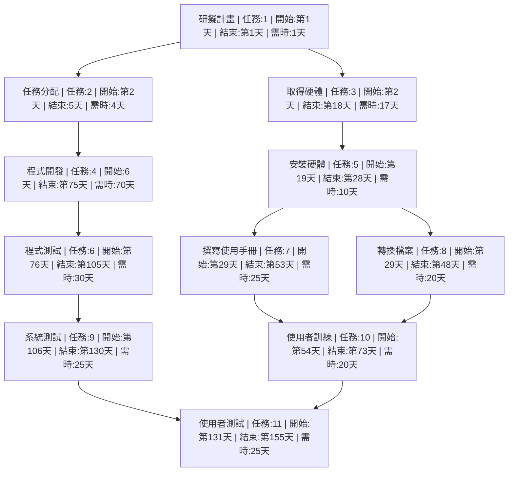

# PERT/CPM 圖

```mermaid
graph TD	
    no1["研擬計畫 | 任務:1 | 開始:第1天 | 結束:第1天 | 需時:1天"] --> no2["任務分配 | 任務:2 | 開始:第2天 | 結束:5天 | 需時:4天"]    
    no1 --> no3["取得硬體 | 任務:3 | 開始:第2天 | 結束:第18天 | 需時:17天"]
      
    no2 --> no4["程式開發 | 任務:4 | 開始:6天 | 結束:第75天 | 需時:70天"]
    
    no3 --> no5["安裝硬體 | 任務:5 | 開始:第19天 | 結束:第28天 | 需時:10天"]
    
    no4 --> no6["程式測試 | 任務:6 | 開始:第76天 | 結束:第105天 | 需時:30天"]
    
    no5 --> no7["撰寫使用手冊 | 任務:7 | 開始:第29天 | 結束:第53天 | 需時:25天"]
    no5 --> no8["轉換檔案 | 任務:8 | 開始:第29天 | 結束:第48天 | 需時:20天"]
    
    no6 --> no9["系統測試 | 任務:9 | 開始:第106天 | 結束:第130天 | 需時:25天"]
    
    no7 --> no10["使用者訓練 | 任務:10 | 開始:第54天 | 結束:第73天 | 需時:20天"]
    no8 --> no10
    
    no9 --> no11["使用者測試 | 任務:11 | 開始:第131天 | 結束:第155天 | 需時:25天"]
    no10 -->no11
   
```
