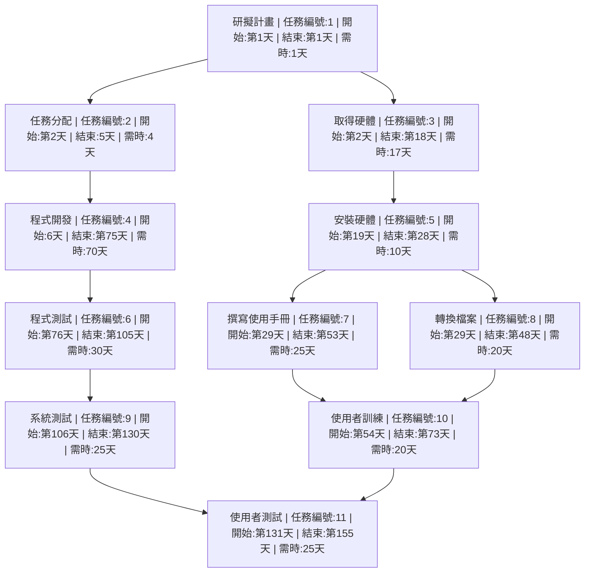
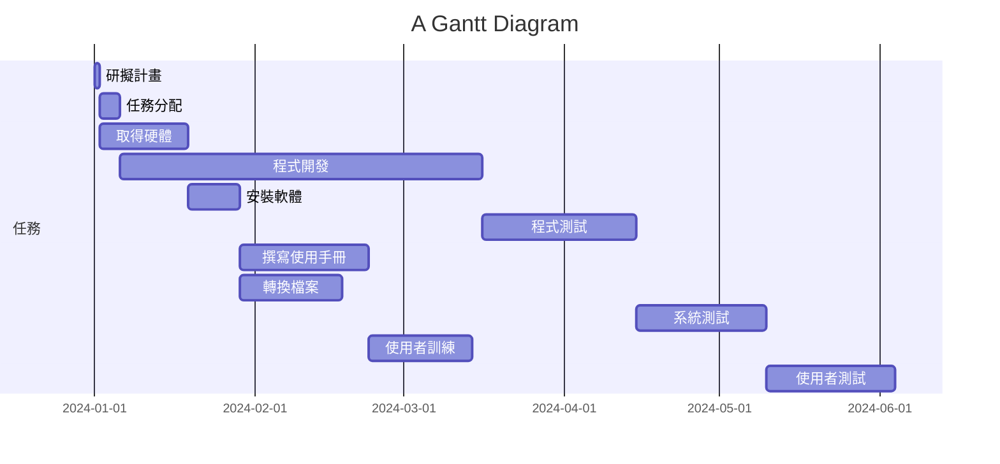

# PERT/CPM 圖

```mermaid
graph TD	
    no1["研擬計畫 | 任務編號:1 | 開始:第1天 | 結束:第1天 | 需時:1天"] --> no2["任務分配 | 任務編號:2 | 開始:第2天 | 結束:5天 | 需時:4天"]    
    no1 --> no3["取得硬體 | 任務編號:3 | 開始:第2天 | 結束:第18天 | 需時:17天"]
      
    no2 --> no4["程式開發 | 任務編號:4 | 開始:6天 | 結束:第75天 | 需時:70天"]
    
    no3 --> no5["安裝硬體 | 任務編號:5 | 開始:第19天 | 結束:第28天 | 需時:10天"]
    
    no4 --> no6["程式測試 | 任務編號:6 | 開始:第76天 | 結束:第105天 | 需時:30天"]
    
    no5 --> no7["撰寫使用手冊 | 任務編號:7 | 開始:第29天 | 結束:第53天 | 需時:25天"]
    no5 --> no8["轉換檔案 | 任務編號:8 | 開始:第29天 | 結束:第48天 | 需時:20天"]
    
    no6 --> no9["系統測試 | 任務編號:9 | 開始:第106天 | 結束:第130天 | 需時:25天"]
    
    no7 --> no10["使用者訓練 | 任務編號:10 | 開始:第54天 | 結束:第73天 | 需時:20天"]
    no8 --> no10
    
    no9 --> no11["使用者測試 | 任務編號:11 | 開始:第131天 | 結束:第155天 | 需時:25天"]
    no10 -->no11
   
```
# 甘特圖

```mermaid
gantt
     title A Gantt Diagram
     dateFormat  YYYY-MM-DD
     section 任務

    研擬計畫           :a1, 2024-01-01, 1d
    任務分配           :a2, after a1, 4d
    取得硬體           :a3, after a1, 17d
    程式開發           :a4, after a2, 70d
    安裝軟體           :a5, after a3, 10d
    程式測試           :a6, after a4, 30d
    撰寫使用手冊       :a7, after a5, 25d
    轉換檔案           :a8, after a5, 20d
    系統測試           :a9, after a6, 25d
    使用者訓練         :a10, after a7, 20d
    使用者測試         :a11, after a9, 25d
```
